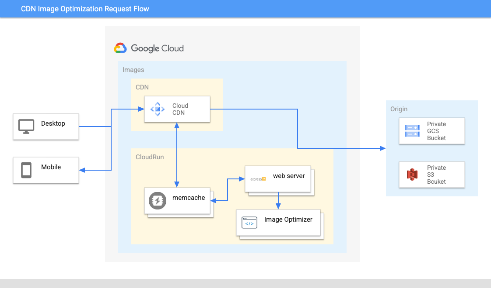
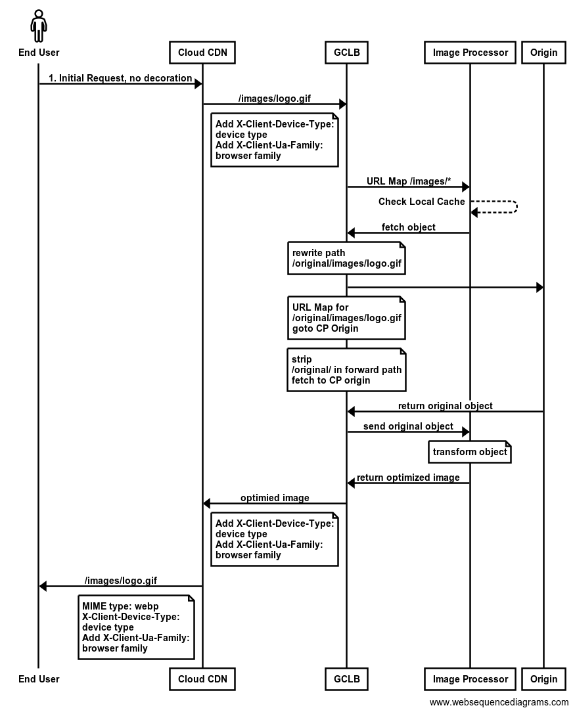

# Google CDN Image Optimizer

## Use case
This Node.js module is for converting large images in common formats to smaller, web-friendly **JPEG**, **JPEG 2000**, **JPEG XL**, **PNG**, **WebP**, **GIF** and **AVIF** images of varying dimensions.

With the integration of [Cloud CDN Content Targeting](http://go/customer-cloud-cdn-modify-cache-key), you get the benefits of image optimization based on `device_type` and `user_agent_famliy` out of the box, with optional customizations of image **width**, **height**, and **quality**.

## Formats

This module supports reading **JPEG, PNG, WebP, GIF, AVIF, TIFF and SVG** images.

Output images can be in **JPEG**, **JPEG 2000**, **JPEG XL**, **PNG**, **WebP**, **GIF**, **AVIF** and **TIFF** formats as well as uncompressed **raw pixel data**.

## Diagrams





## Deploy with CloudCDN via Terraform

1. Clone this repo.
   ```
   git clone https://source.developers.google.com/p/na294c7a396895cf2-tp/r/cdn-image-optimizer
   ```

1. Change to the Infrastructure deployment directory.
   ```
   cd infra
   ```

1. Open `variables.tf`, put in your own **project_id**, **project_number**, **cloudrun_region**, **origin_fqdn** and **origin_base_path** then save.
(leave **imageopt_svc_image** as default unless you want to use your own custom-built container image)
    ```
    variable "project_id" {
        type        = string
        default     = "xxxx"
        description = "Project ID"
    }

    variable "project_number" {
        type        = string
        default     = "xxxx"
        description = "Project Number"
    }

    variable "cloudrun_region" {
        type        = string
        default     = "us-east1"
        description = "Default region"
    }

    variable "imageopt_svc_image" {
        type        = string
        default     = "us-east1-docker.pkg.dev/img-optimization/img-optimization-repo-1088347617355/image-optimizer:latest"
        description = "Default region"
    }

    variable "origin_fqdn" {
        type        = string
        description = "FQDN of origin"
        default     = "xxx.xxxx.xxx"
    }

    variable "origin_base_path" {
        type        = string
        description = "base path for images on origin"
        default     = "/xxxx/"
    }
    ```


1. Run the following commands to initiate Terraform for deployment. 
    ```
    terraform init
    terraform plan
    terraform apply -auto-approve
    ```

## Demo Page

[Cloud CDN Demo Page](https://images.thegoogle.cloud/cdn-IO.html)