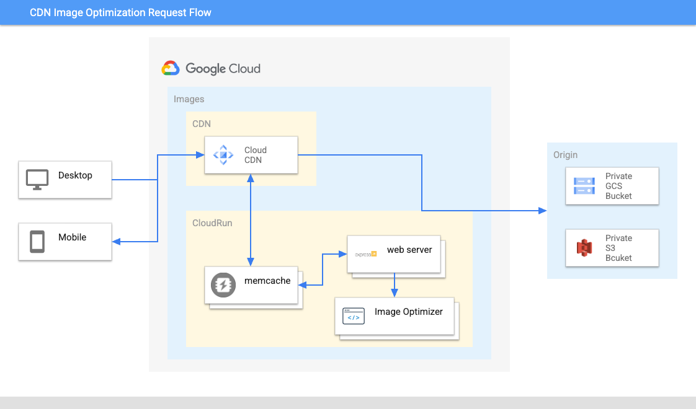
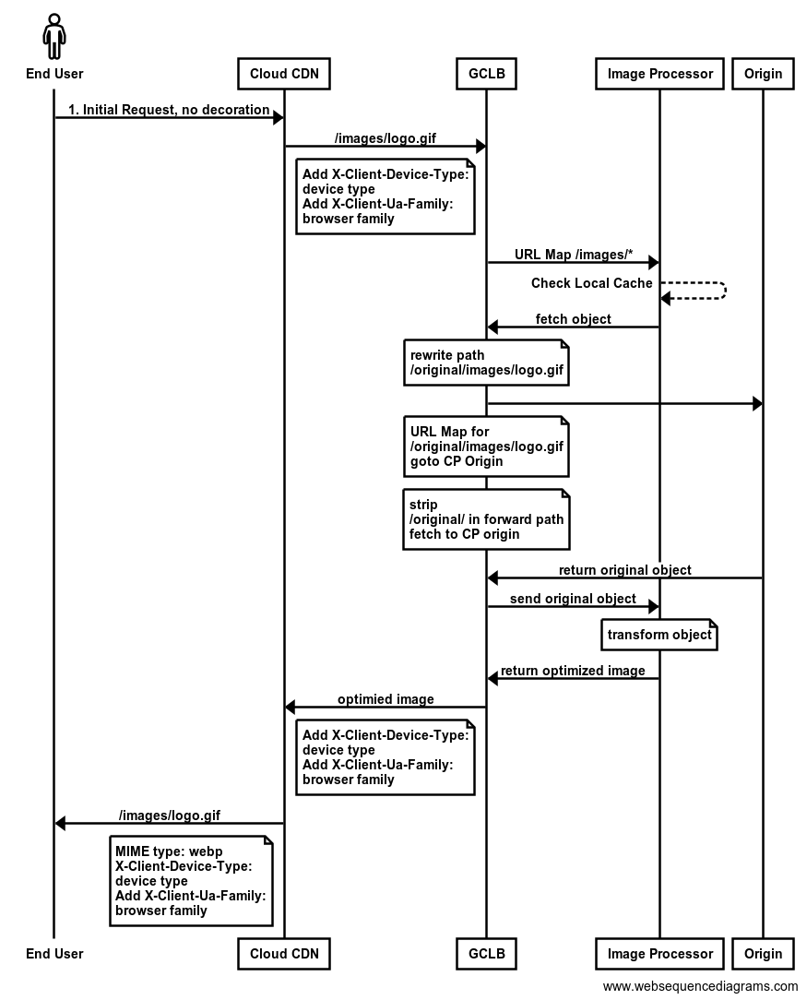

# Google CDN Image Optimizer

## Overview
A high-performance, containerized image transformation service built on **Sharp**. It provides dynamic on-the-fly image resizing, format conversion, and compression optimized for **Google Cloud CDN** and **Google Media CDN**.

### Key Features
- **Device-Aware Optimization:** Automatically tunes image quality based on client device characterization (`desktop`, `tablet`, `mobile`, `smart_tv`, etc.).
- **Next-Gen Image Formats:** Converts legacy formats to smaller, web-friendly **WebP**, **JPEG XL**, **JPEG 2000**, and optimized **JPEG/PNG/GIF**.
- **Two-Tier Caching Architecture:**
  - **Tier 1:** Google Cloud CDN / Media CDN edge cache with custom cache keys based on format, dimensions, device type, and UA family.
  - **Tier 2:** High-speed in-memory LRU cache on Cloud Run to eliminate redundant image processing.
- **Auto-Rotation:** Automatically reads EXIF orientation tags and rotates images correctly.
- **Legacy Browser Support:** Automatically falls back to standard JPEG for legacy user agents (such as MSIE).

---

## Supported Formats

| Category | Formats |
| :--- | :--- |
| **Input / Source** | JPEG, PNG, WebP, GIF, TIFF, SVG |
| **Output / Optimized** | WebP, JPEG, JPEG 2000 (`jp2`), JPEG XL (`jxl`), PNG, GIF, TIFF, Raw pixel data |

> [!NOTE]
> **AVIF support** is currently disabled pending upstream libvips heif plugin updates.

---

## Diagrams





---

## Transformation API & Query Parameters

Requests to `/images/*` accept the following query parameters for dynamic transformations:

| Parameter | Type | Default | Allowed Values / Description | Example |
| :--- | :--- | :--- | :--- | :--- |
| `w` | Integer | Source width | Target width in pixels (`1` to `4096`). | `?w=800` |
| `h` | Integer | Source height | Target height in pixels (`1` to `4096`). | `?h=600` |
| `f` | String | `webp` | Target format: `webp`, `jpg`, `jpeg`, `png`, `gif`, `jp2`, `jxl`, `tiff`, `raw`. | `?f=webp` |
| `q` | Integer | Device-based | Compression quality (`1` to `100`). If omitted, automatically determined by device type. | `?q=75` |
| `fit` | String | `cover` | Resizing strategy: `cover`, `contain`, `fill`, `inside`, `outside`. | `?fit=contain` |
| `p` | String | `center` | Crop anchor position / gravity: `top`, `bottom`, `left`, `right`, `left_top`, `right_top`, `left_bottom`, `right_bottom`, `center`. | `?p=top` |

### Default Quality by Device Type
When `q` is not specified in the query string, quality is auto-assigned based on upstream CDN characterization headers:
- **Desktop:** `q=60`
- **Tablet / Smart TV / Game Console / Set-Top Box:** `q=40`
- **Mobile / Wearable / Smart Speaker:** `q=20`
- **Default / Unspecified:** `q=40`

### Fit Modes Explained
- `cover` *(default)*: Preserves aspect ratio, crops image to cover both provided dimensions.
- `contain`: Preserves aspect ratio, letterboxes image inside provided dimensions.
- `fill`: Stretches image to exact width and height without maintaining aspect ratio.
- `inside`: Preserves aspect ratio, resizes image to fit completely within width/height boundaries.
- `outside`: Preserves aspect ratio, resizes image to be as small as possible while ensuring dimensions are greater than or equal to targets.

---

## CDN Header Integration

The service integrates seamlessly with Google Cloud CDN and Media CDN using custom request and response headers:

### Upstream Request Headers
- `x-client-device-type`: Injected by CDN (`desktop`, `tablet`, `mobile`, `smart_tv`, `game_console`, etc.).
- `x-client-ua-family`: Injected by CDN user-agent characterization (e.g. `Chrome`, `Safari`, `MSIE`).
- `x-client-host`: Populated by CDN / TLS SNI for multi-tenant or origin domain resolution.
- `x-client-accept`: Client `Accept` header forwarded for content negotiation.

### Response Headers
- `X-IO-Cache`: Reports Cloud Run origin cache status (`HIT` or `MISS`).
- `X-IO-Cache-Key`: Cache key generated from format, quality, dimensions, position, fit, and URL path.
- `x-cache-status` / `x-mcdn-cache-status`: Upstream CDN edge cache status (`HIT`, `MISS`, `REVALIDATED`).

---

## Deployment

### Option 1: Deploy to Google Cloud CDN via Terraform

1. **Clone the repository:**
   ```bash
   git clone https://github.com/CDN-guy/google-cdn-image-optimization.git
   cd google-cdn-image-optimization/infra
   ```

2. **Create your `infra.tfvars` file:**
   ```hcl
   project_id       = "your-gcp-project-id"
   project_number   = "123456789012"
   cloudrun_region  = "us-central1"
   origin_fqdn      = "images.example.com"
   origin_base_path = "/original/"
   ```

   | Variable | Description | Default |
   | :--- | :--- | :--- |
   | `project_id` | GCP Project ID | *Required* |
   | `project_number` | GCP Project Number | *Required* |
   | `cloudrun_region` | GCP Region where Cloud Run is deployed | `us-east1` |
   | `origin_fqdn` | FQDN of the backend origin holding original images | *Required* |
   | `origin_base_path` | Base path on origin server | `/original/` |
   | `imageopt_svc_image`| Artifact Registry container image URL | Default prebuilt image |

3. **Deploy with Terraform:**
   ```bash
   terraform init
   terraform plan -var-file="infra.tfvars"
   terraform apply -var-file="infra.tfvars" -auto-approve
   ```

---

### Option 2: Deploy to Google Media CDN via Terraform

> [!IMPORTANT]
> Media CDN requires your Google Cloud project to be allowlisted. Contact your Google Cloud sales or account team if access is not yet enabled.

1. **Change to the Media CDN infrastructure directory:**
   ```bash
   cd google-cdn-image-optimization/infra_mcdn
   ```

2. **Create your `infra_mcdn.tfvars` file:**
   ```hcl
   project_id       = "your-gcp-project-id"
   project_number   = "123456789012"
   cloudrun_region  = "us-central1"
   origin_fqdn      = "images.example.com"
   origin_base_path = "/"
   ```

3. **Deploy with Terraform:**
   ```bash
   terraform init
   terraform plan -var-file="infra_mcdn.tfvars"
   terraform apply -var-file="infra_mcdn.tfvars" -auto-approve
   ```

---

## Custom Container Build (Optional)

If you wish to build and push your own container image to Artifact Registry rather than using the default prebuilt image:

1. Edit the configuration variables in [`infra/bootstrap.sh`](infra/bootstrap.sh) (or [`infra_mcdn/bootstrap.sh`](infra_mcdn/bootstrap.sh)):
   ```bash
   PROJECT_ID="your-gcp-project-id"
   PROJECT_NUM="123456789012"
   LOCATION="us-central1"
   REPO_NAME="img-opt"
   ```

2. Run the bootstrap script:
   ```bash
   chmod +x bootstrap.sh
   ./bootstrap.sh
   ```

---

## Local Development & Docker

### Running Locally with Node.js
```bash
cd src
npm install
npm start
```
The server will start listening on `http://localhost:8080`.

### Running Locally with Docker
```bash
cd src
docker build -t image-optimizer .
docker run -p 8080:8080 image-optimizer
```

---

## Demo Pages

- [Cloud CDN Demo Page](https://images.thegoogle.cloud/cdn-IO.html)
- [Media CDN Demo Page](https://media-cdn.thegoogle.cloud/image-opt-demo.html)

---

## License

This project is licensed under the [MIT License](LICENSE).